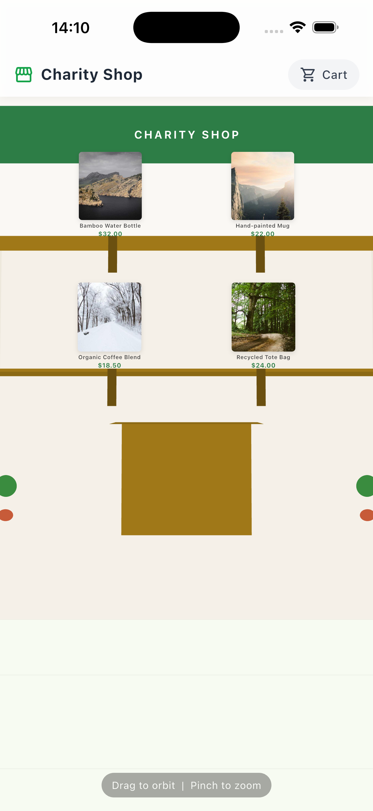
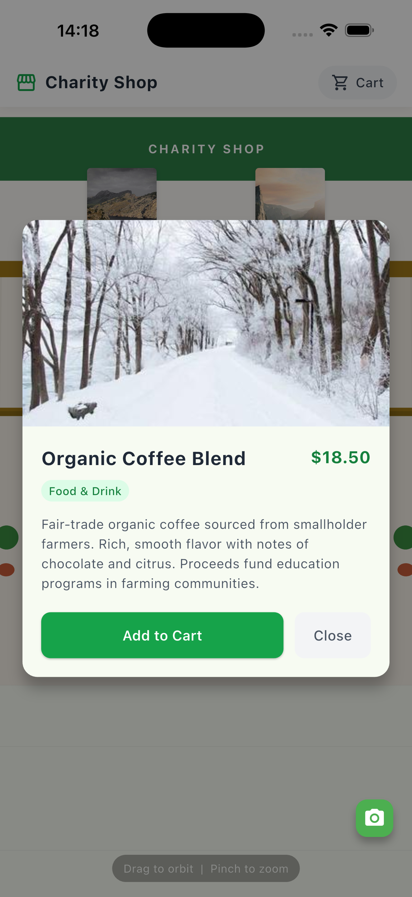
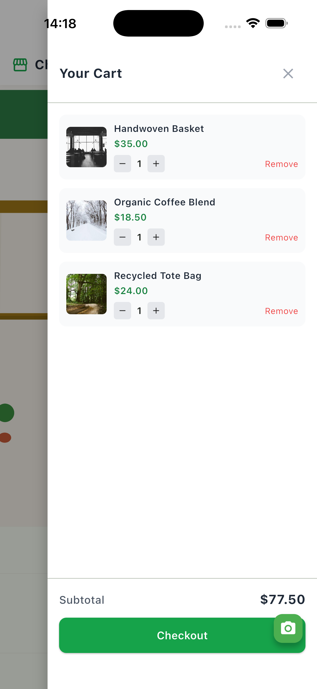

# Flutter Charity Shop 3D

An immersive 3D charitable shopping experience built with Flutter, featuring a perspective-rendered 3D shop room, Shopify Storefront API integration, and a full shopping cart.

## Screenshots

| 3D Shop Scene | Product Detail | Shopping Cart |
|:---:|:---:|:---:|
|  |  |  |

## Features

- **3D Environment** - Custom perspective-projected shop room rendered with `CustomPainter` (walls, floor, ceiling, shelves, counter, sign, plants)
- **Camera Controls** - Drag to orbit, pinch to zoom the 3D scene
- **Product Displays** - Product images positioned in 3D space on wall shelves with hover/tap effects
- **Shopify Integration** - Connects to Shopify Storefront API via GraphQL; falls back to mock data
- **Shopping Cart** - Full cart CRUD with slide-out drawer, quantity controls, subtotal
- **Product Details** - Tap any product for a modal overlay with description and "Add to Cart"
- **Keyboard Support** - Escape to close modals and cart (desktop/web)

## Tech Stack

| Layer | Technology |
|-------|-----------|
| Framework | Flutter 3.x + Dart |
| 3D Rendering | CustomPainter + vector_math (perspective projection) |
| Commerce | Shopify Storefront API via http + GraphQL |
| State | Riverpod 3.x (Notifier pattern) |
| Images | cached_network_image |

## Quick Start

```bash
git clone https://github.com/tranthienhau/flutter-charity-shop.git
cd flutter-charity-shop
flutter pub get
flutter run
```

The app runs immediately with 8 mock charity products. No API keys needed.

## Shopify Integration (Optional)

Create a `.env` file from the example:

```bash
cp .env.example .env
```

| Variable | Description |
|----------|-------------|
| `SHOPIFY_DOMAIN` | Your Shopify store domain (e.g. `my-store.myshopify.com`) |
| `SHOPIFY_STOREFRONT_TOKEN` | Storefront API access token |

If credentials are missing or the API call fails, the app automatically falls back to mock products.

## Architecture

```
lib/
  models/         # Product, CartItem data classes
  services/       # Shopify GraphQL client + mock data fallback
  providers/      # Riverpod providers (cart, products, camera, modals)
  screens/        # ShopScreen (main screen with keyboard listener)
  widgets/
    scene/        # 3D rendering (RoomPainter, ProductDisplay3D, ShopScene3D)
    layout/       # UI overlays (header, cart drawer, product modal, loading)
  utils/          # formatCurrency helper
```

Key decisions:
- **CustomPainter + perspective projection** over 3D engine packages, for zero native dependencies and full platform support
- **Depth-sorted product widgets** overlaid on the painted scene, so product images use Flutter's standard image pipeline
- **Separate Riverpod Notifiers** for cart, camera, and selection state to minimize rebuilds
- **graphql-request via http** over Shopify Buy SDK, keeping the dependency footprint minimal
